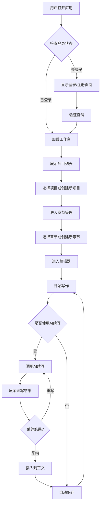
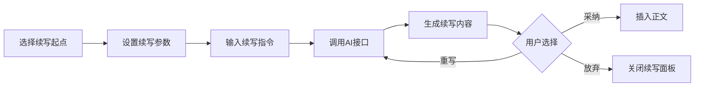

# 梦织机·Novelist Studio 产品需求文档

## 1. 产品概述

**梦织机·Novelist Studio** 是一款面向网络小说作者的长篇创作工作台，旨在提供沉浸式、高效的写作体验。通过整合AI续写、设定管理、章节组织和云端同步等功能，帮助作者专注于创作本身，提升写作效率和质量。

**核心价值：**
- 降低长篇创作的心理负担
- 提供智能化写作辅助
- 保障数据安全与多端同步
- 营造专注的创作氛围

**目标用户：**
- 网络小说作者
- 业余写作者
- 有长篇创作需求的文字工作者

## 2. 核心功能模块

### 2.1 用户角色

| 角色 | 注册方式 | 核心权限 |
|------|---------|---------|
| 访客 | 无需注册 | 浏览公开作品信息 |
| 注册用户 | 邮箱/手机号注册 | 创建项目、写作、AI辅助、设定管理 |
| 管理员 | 系统分配 | 用户管理、内容审核、数据统计 |

### 2.2 功能模块

1. **项目管理模块**
   - 创建、编辑、删除小说项目
   - 项目信息设置（标题、简介、封面、标签）
   - 项目列表展示与筛选
   - 最近项目快速访问

2. **章节管理模块**
   - 章节的增删改查
   - 章节排序与拖拽调整
   - 章节状态管理（草稿、待审、已发布）
   - 批量操作支持
   - 章节大纲与内容分离管理

3. **AI续写模块**
   - 基于上下文的智能续写
   - 续写风格选择（热血、言情、悬疑等）
   - 续写字数控制
   - 续写历史记录
   - 一键采纳或重写

4. **设定管理模块**
   - 世界观设定（地理、历史、势力等）
   - 角色设定（人物卡片、关系图谱）
   - 物品/道具设定
   - 章节与设定的关联标记
   - 设定搜索与引用

5. **编辑器模块**
   - 富文本编辑器
   - Markdown支持
   - 写作字数统计
   - 写作时长统计
   - 自动保存
   - 历史版本记录
   - 快捷键支持

6. **云同步模块**
   - 实时数据同步
   - 多设备登录支持
   - 冲突解决机制
   - 离线写作支持

### 2.3 页面详情

| 页面名称 | 模块名称 | 功能描述 |
|---------|---------|---------|
| 首页/工作台 | 加载页面 | 显示初始化进度（连接服务、加载项目、恢复工作区） |
| 首页/工作台 | 项目列表 | 展示所有小说项目，支持创建新项目 |
| 项目详情 | 章节列表 | 当前项目的所有章节，支持拖拽排序 |
| 章节编辑 | 富文本编辑器 | 写作界面，支持AI续写、字数统计 |
| 设定管理 | 设定面板 | 世界观、角色、物品等设定的CRUD |
| AI续写 | 续写助手 | 上下文续写、风格选择、结果采纳 |
| 个人中心 | 用户设置 | 账户信息、偏好设置、数据管理 |
| 云同步 | 同步状态 | 实时同步状态、手动同步、数据导出 |

## 3. 核心流程

### 3.1 主要用户流程

### 3.2 AI续写流程

## 4. 用户界面设计

### 4.1 设计风格

**设计理念：沉浸式创作体验**

- **整体色调**：深色主题为主，营造专注的写作氛围
  - 主色：深靛蓝 `#1a1b2e` 
  - 次要色：暗紫色 `#2d2a4a`
  - 强调色：暖金色 `#d4af37`
  - 文字色：米白色 `#e8e6e3`
  - 次要文字：`#8b8997`

- **按钮风格**：圆角矩形，悬停时有柔和的发光效果
- **字体选择**：
  - 标题：思源宋体（营造文学氛围）
  - 正文：思源黑体（清晰易读）
  - 代码/大纲：JetBrains Mono
- **布局风格**：
  - 左侧固定导航栏
  - 中央主内容区
  - 右侧可折叠的设定/工具面板
  - 卡片式项目管理

### 4.2 页面设计概览

#### 加载页面（工作台初始化）
- **布局**：居中显示
- **元素**：
  - Logo与标题
  - 三个加载步骤（带图标和进度指示）
  - 加载动画（丝线编织的意象）
- **动画**：渐入效果，丝线流动动画

#### 项目列表页面
- **布局**：网格/列表双视图切换
- **元素**：
  - 顶部工具栏（搜索、筛选、排序）
  - 项目卡片（封面、标题、字数、更新时间）
  - 创建新项目按钮
- **交互**：
  - 卡片悬停时微微上浮
  - 右键菜单（编辑、删除、导出）

#### 章节编辑器页面
- **布局**：三栏式（大纲/正文/设定）
- **元素**：
  - 顶部工具栏（保存、撤销、重做、AI续写）
  - 左侧大纲面板（可折叠）
  - 中央编辑区（全屏沉浸模式）
  - 右侧设定面板（可折叠）
  - 底部状态栏（字数、写作时长、同步状态）
- **交互**：
  - 全屏模式切换
  - 双击选中文字调用AI改写
  - 快捷键支持（Ctrl+S保存、Ctrl+Z撤销等）

### 4.3 响应式设计

- **桌面优先**：1200px以上为最佳体验
- **平板适配**：1024px以下收起侧边栏
- **移动端**：768px以下简化为单栏布局，底部Tab导航
- **触摸优化**：移动端按钮增大触控区域

## 5. 非功能性需求

### 5.1 性能要求
- 页面首次加载时间 < 3秒
- 编辑器输入延迟 < 50ms
- AI续写响应时间 < 5秒（取决于API）
- 自动保存间隔 < 30秒

### 5.2 安全性要求
- 用户密码加密存储
- JWT Token认证
- 数据传输使用HTTPS
- 敏感操作需要二次确认

### 5.3 可用性要求
- 支持Chrome、Firefox、Safari、Edge最新两个版本
- 数据备份与恢复功能
- 操作撤销/重做支持
- 键盘快捷键覆盖常用操作

## 6. 项目范围

### 6.1 MVP版本功能（第一期）
- 用户注册与登录
- 项目CRUD
- 章节CRUD
- 富文本编辑器
- 自动保存
- 本地数据存储

### 6.2 第二期功能
- AI续写集成
- 设定管理
- 云端同步
- 历史版本

### 6.3 第三期功能
- 多人协作
- 数据导出
- 社区分享
- 高级AI功能
