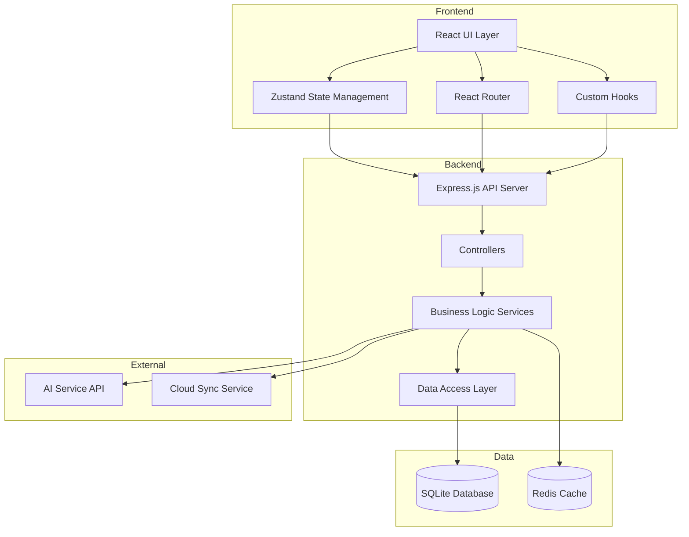
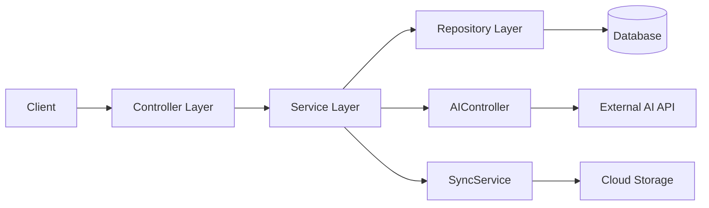
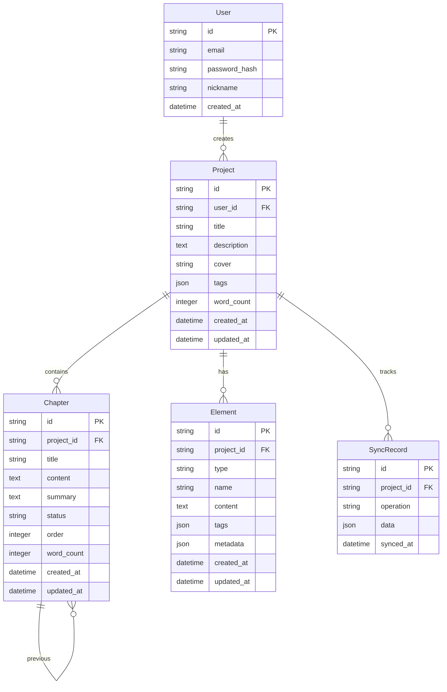

# 梦织机·Novelist Studio 技术架构文档

## 1. 架构设计



## 2. 技术选型

### 2.1 前端技术栈

| 技术 | 版本 | 用途 |
|------|------|------|
| React | 18.x | UI框架 |
| TypeScript | 5.x | 类型安全 |
| Vite | 5.x | 构建工具 |
| TailwindCSS | 3.x | 样式框架 |
| Zustand | 4.x | 状态管理 |
| React Router | 6.x | 路由管理 |
| TipTap | 2.x | 富文本编辑器 |
| Lucide React | latest | 图标库 |

### 2.2 后端技术栈

| 技术 | 版本 | 用途 |
|------|------|------|
| Express.js | 4.x | Web框架 |
| TypeScript | 5.x | 类型安全 |
| better-sqlite3 | 9.x | 数据库 |
| JWT | - | 身份认证 |
| bcrypt | 5.x | 密码加密 |
| zod | 3.x | 数据验证 |

### 2.3 开发工具

| 工具 | 用途 |
|------|------|
| ESLint | 代码检查 |
| Prettier | 代码格式化 |
| nodemon | 后端热重载 |

## 3. 路由定义

### 3.1 前端路由

| 路由 | 页面 | 权限 |
|------|------|------|
| `/` | 首页/加载页面 | 公开 |
| `/login` | 登录页面 | 公开 |
| `/register` | 注册页面 | 公开 |
| `/dashboard` | 工作台/项目列表 | 需要登录 |
| `/project/:id` | 项目详情 | 需要登录 |
| `/project/:id/chapter/:chapterId` | 章节编辑 | 需要登录 |
| `/settings` | 个人设置 | 需要登录 |
| `/sync` | 云同步状态 | 需要登录 |

### 3.2 后端API路由

#### 认证模块 `/api/auth`
| 方法 | 路由 | 描述 |
|------|------|------|
| POST | `/api/auth/register` | 用户注册 |
| POST | `/api/auth/login` | 用户登录 |
| POST | `/api/auth/logout` | 用户登出 |
| GET | `/api/auth/me` | 获取当前用户信息 |

#### 项目模块 `/api/projects`
| 方法 | 路由 | 描述 |
|------|------|------|
| GET | `/api/projects` | 获取用户所有项目 |
| POST | `/api/projects` | 创建新项目 |
| GET | `/api/projects/:id` | 获取项目详情 |
| PUT | `/api/projects/:id` | 更新项目 |
| DELETE | `/api/projects/:id` | 删除项目 |

#### 章节模块 `/api/projects/:projectId/chapters`
| 方法 | 路由 | 描述 |
|------|------|------|
| GET | `/api/projects/:projectId/chapters` | 获取项目所有章节 |
| POST | `/api/projects/:projectId/chapters` | 创建新章节 |
| GET | `/api/projects/:projectId/chapters/:id` | 获取章节详情 |
| PUT | `/api/projects/:projectId/chapters/:id` | 更新章节 |
| DELETE | `/api/projects/:projectId/chapters/:id` | 删除章节 |
| PUT | `/api/projects/:projectId/chapters/reorder` | 批量更新章节顺序 |

#### 设定模块 `/api/projects/:projectId/elements`
| 方法 | 路由 | 描述 |
|------|------|------|
| GET | `/api/projects/:projectId/elements` | 获取所有设定 |
| POST | `/api/projects/:projectId/elements` | 创建新设定 |
| PUT | `/api/projects/:projectId/elements/:id` | 更新设定 |
| DELETE | `/api/projects/:projectId/elements/:id` | 删除设定 |

#### AI模块 `/api/ai`
| 方法 | 路由 | 描述 |
|------|------|------|
| POST | `/api/ai/continue` | AI续写 |
| POST | `/api/ai/rewrite` | AI改写 |
| POST | `/api/ai/summarize` | AI摘要 |

#### 同步模块 `/api/sync`
| 方法 | 路由 | 描述 |
|------|------|------|
| GET | `/api/sync/status` | 获取同步状态 |
| POST | `/api/sync/push` | 推送本地数据 |
| POST | `/api/sync/pull` | 拉取云端数据 |

## 4. API定义

### 4.1 认证相关

#### POST /api/auth/register
**Request:**
```typescript
{
  email: string;
  password: string;
  nickname: string;
}
```

**Response:**
```typescript
{
  success: boolean;
  data: {
    user: {
      id: string;
      email: string;
      nickname: string;
    };
    token: string;
  };
}
```

#### POST /api/auth/login
**Request:**
```typescript
{
  email: string;
  password: string;
}
```

**Response:**
```typescript
{
  success: boolean;
  data: {
    user: {
      id: string;
      email: string;
      nickname: string;
    };
    token: string;
  };
}
```

### 4.2 项目相关

#### Project 类型定义
```typescript
interface Project {
  id: string;
  userId: string;
  title: string;
  description?: string;
  cover?: string;
  tags: string[];
  wordCount: number;
  createdAt: Date;
  updatedAt: Date;
}
```

### 4.3 章节相关

#### Chapter 类型定义
```typescript
interface Chapter {
  id: string;
  projectId: string;
  title: string;
  content: string;
  summary?: string;
  status: 'draft' | 'review' | 'published';
  order: number;
  wordCount: number;
  createdAt: Date;
  updatedAt: Date;
}
```

### 4.4 设定相关

#### Element 类型定义
```typescript
interface Element {
  id: string;
  projectId: string;
  type: 'world' | 'character' | 'item';
  name: string;
  content: string;
  tags: string[];
  metadata?: Record<string, any>;
  createdAt: Date;
  updatedAt: Date;
}
```

### 4.5 AI相关

#### POST /api/ai/continue
**Request:**
```typescript
{
  projectId: string;
  chapterId: string;
  context: string;
  style?: 'normal' | 'passionate' | 'romantic' | 'suspense';
  maxLength?: number;
}
```

**Response:**
```typescript
{
  success: boolean;
  data: {
    content: string;
    reason: string;
  };
}
```

## 5. 服务端架构



### 5.1 控制器层 (Controllers)
- 负责处理HTTP请求/响应
- 输入验证与错误处理
- 路由到对应的Service

### 5.2 服务层 (Services)
- 业务逻辑处理
- 数据转换与组装
- 事务管理

### 5.3 数据访问层 (Repository)
- 数据库CRUD操作
- 查询优化
- 缓存策略

## 6. 数据模型

### 6.1 ER图



### 6.2 数据定义语言 (DDL)

```sql
-- 用户表
CREATE TABLE users (
    id TEXT PRIMARY KEY,
    email TEXT UNIQUE NOT NULL,
    password_hash TEXT NOT NULL,
    nickname TEXT NOT NULL,
    created_at DATETIME DEFAULT CURRENT_TIMESTAMP
);

-- 项目表
CREATE TABLE projects (
    id TEXT PRIMARY KEY,
    user_id TEXT NOT NULL,
    title TEXT NOT NULL,
    description TEXT,
    cover TEXT,
    tags JSON DEFAULT '[]',
    word_count INTEGER DEFAULT 0,
    created_at DATETIME DEFAULT CURRENT_TIMESTAMP,
    updated_at DATETIME DEFAULT CURRENT_TIMESTAMP,
    FOREIGN KEY (user_id) REFERENCES users(id)
);

-- 章节表
CREATE TABLE chapters (
    id TEXT PRIMARY KEY,
    project_id TEXT NOT NULL,
    title TEXT NOT NULL,
    content TEXT DEFAULT '',
    summary TEXT,
    status TEXT DEFAULT 'draft',
    chapter_order INTEGER NOT NULL,
    word_count INTEGER DEFAULT 0,
    created_at DATETIME DEFAULT CURRENT_TIMESTAMP,
    updated_at DATETIME DEFAULT CURRENT_TIMESTAMP,
    FOREIGN KEY (project_id) REFERENCES projects(id)
);

-- 设定表
CREATE TABLE elements (
    id TEXT PRIMARY KEY,
    project_id TEXT NOT NULL,
    type TEXT NOT NULL,
    name TEXT NOT NULL,
    content TEXT DEFAULT '',
    tags JSON DEFAULT '[]',
    metadata JSON,
    created_at DATETIME DEFAULT CURRENT_TIMESTAMP,
    updated_at DATETIME DEFAULT CURRENT_TIMESTAMP,
    FOREIGN KEY (project_id) REFERENCES projects(id)
);

-- 同步记录表
CREATE TABLE sync_records (
    id TEXT PRIMARY KEY,
    project_id TEXT NOT NULL,
    operation TEXT NOT NULL,
    data JSON,
    synced_at DATETIME DEFAULT CURRENT_TIMESTAMP,
    FOREIGN KEY (project_id) REFERENCES projects(id)
);

-- 索引
CREATE INDEX idx_projects_user ON projects(user_id);
CREATE INDEX idx_chapters_project ON chapters(project_id);
CREATE INDEX idx_elements_project ON elements(project_id);
CREATE INDEX idx_sync_project ON sync_records(project_id);
```

## 7. 项目结构

```
/workspace
├── src/                          # 前端源代码
│   ├── components/              # 通用组件
│   │   ├── common/              # 通用UI组件
│   │   ├── editor/              # 编辑器相关组件
│   │   └── layout/              # 布局组件
│   ├── pages/                   # 页面组件
│   │   ├── Home.tsx
│   │   ├── Login.tsx
│   │   ├── Register.tsx
│   │   ├── Dashboard.tsx
│   │   ├── Project.tsx
│   │   ├── Editor.tsx
│   │   └── Settings.tsx
│   ├── hooks/                   # 自定义Hooks
│   ├── stores/                  # Zustand状态管理
│   ├── services/               # API服务
│   ├── types/                  # TypeScript类型定义
│   ├── utils/                  # 工具函数
│   └── styles/                 # 全局样式
│
├── api/                         # 后端源代码
│   ├── controllers/             # 控制器
│   ├── services/               # 业务逻辑
│   ├── repositories/           # 数据访问
│   ├── middleware/             # 中间件
│   ├── routes/                 # 路由定义
│   ├── utils/                  # 工具函数
│   └── index.ts                # 后端入口
│
├── shared/                      # 共享类型定义
│   └── types/
│
├── migrations/                 # 数据库迁移脚本
│
├── .trae/
│   └── documents/              # 文档目录
│       ├── PRD.md
│       └── Technical-Architecture.md
│
├── package.json
├── tsconfig.json
├── vite.config.ts
├── tailwind.config.js
└── .env.example
```

## 8. 环境变量

```env
# 前端
VITE_API_BASE_URL=http://localhost:3001/api
VITE_APP_NAME=梦织机·Novelist Studio

# 后端
PORT=3001
NODE_ENV=development
DATABASE_PATH=./data/novelist.db
JWT_SECRET=your-secret-key-here

# AI服务 (可选)
AI_API_KEY=your-ai-api-key
AI_API_URL=https://api.example.com/v1
```
